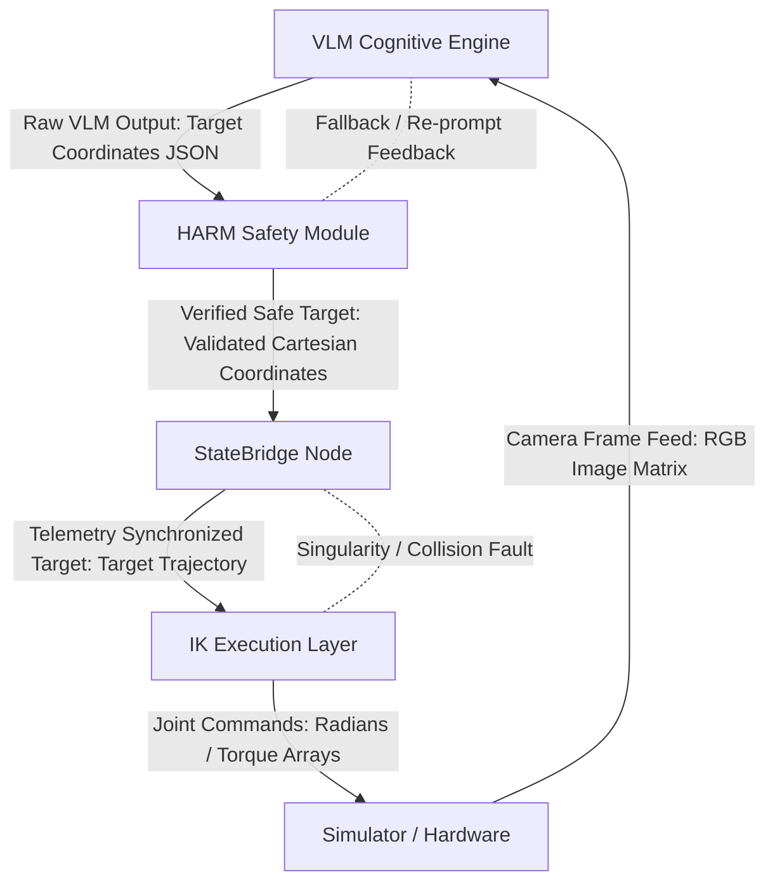

## 1. Quick Start

### Prerequisites
Clone the repository into your local workspace or environment:

HTTPS (Use Personal Access Token if private repo)
git clone https://<YOUR_GITHUB_TOKEN>@github.com/HRAF-Research/hraf-middleware.git

Or via SSH
git clone git@github.com:HRAF-Research/hraf-middleware.git

### Execution Example

The following minimal working example demonstrates how to instantiate, execute a command through, and stop the combined ADCA + HARM middleware stack in Python.

```python
import sys
sys.path.append("src/hraf-middleware/src")

from hraf.harm import HARM
from hraf.ros_node import HRAFMiddlewareNode

# 1. Instantiate HARM safety engine
harm_engine = HARM()

# 2. Instantiate ADCA ROS Node with HARM reference (Start)
middleware = HRAFMiddlewareNode(harm_pipeline_instance=harm_engine)

# 3. Define robot state telemetry container
class RobotState:
    def __init__(self):
        self.positions = [0.0, 0.0, 0.0]

# 4. Process and validate raw VLM output
state = RobotState()
vlm_cmd, harm_result = harm_engine.validate(
    '{"action": "MOVE", "waypoints": [[0.1, 0.2, 0.3]]}', 
    last_state=state
)

print(f"VLM Command: {vlm_cmd}")
print(f"HARM Result: {harm_result}")
```


## 2. Architecture Diagram

The block diagram below illustrates the end-to-end data pipeline flow and interface boundaries across the VLM cognitive loop, HARM safety shield, StateBridge telemetry manager, and IK execution layer.



### Interface Specifications

| Interface Boundary | Primary Data Payload | Error States / Fallback Behaviors |
| :--- | :--- | :--- |
| **Simulator → VLM** | Camera Frame Feed (RGB Image Matrix) | `SimulationFault` |
| **VLM → HARM** | Target Destination (Raw Coordinates JSON Matrix) | `JSONFormattingError`, `TargetHallucination` |
| **HARM → StateBridge** | Verified Safe Target (Validated Cartesian Coordinates) | `ValidationError`, `WorkspaceBoundViolation`, `LimitExceededError` |
| **StateBridge → IK** | Telemetry Synchronized Target (Joint/Cartesian Trajectory) | `StateDesyncError`, `TelemetryTimeout` |
| **IK → Simulator** | Joint Commands (Trajectory Arrays in Radians/Torque) | `KinematicSingularity`, `SelfCollisionFault` |


## 3. ADCA Configuration

The ADCA (Autonomous Driving & Control Architecture) middleware behavior and safety bounds are controlled through system parameters defined in the configuration framework.

### Parameter Reference Matrix

| Parameter Name | Data Type | Default Value | Description & Operational Impact |
| :--- | :--- | :--- | :--- |
| `vlm_hz` | `float` | `1.0` | Target publishing frequency (in Hz) for the Vision-Language Model cognitive engine stream. Controls visual perception polling rates. |
| `ik_hz` | `float` | `50.0` | Execution update frequency (in Hz) for the Inverse Kinematics controller loop. Governs joint trajectory interpolation rate. |
| `timeout_s` | `float` | `2.0` | Maximum allowable time threshold (in seconds) before triggering a telemetry timeout fault when expecting incoming VLM commands. |
| `workspace_radius` | `float` | `1.0` | Maximum reachability radius boundary (in meters) from origin `(0, 0, 0)`. Waypoints exceeding this distance are clipped by HARM Stage 2. |
| `joint_limit_factor` | `float` | `0.8` | Conservative safety scaling multiplier applied to hardware URDF joint velocity limits (e.g., $1.0\text{ rad/s} \times 0.8 = 0.8\text{ rad/s}$). |

---

### Configuration Example (`config.yaml`)

```yaml
adca:
  nodes:
    vlm_node:
      vlm_hz: 1.0
      timeout_s: 2.0
    ik_node:
      ik_hz: 50.0
  
  harm_safety:
    workspace_radius: 1.0
    joint_limit_factor: 0.8
```


## 4. HARM Configuration

The HARM (Hazard Avoidance & Risk Mitigation) safety module operates across a 3-stage validation pipeline. System behavior, error recovery prompt formats, spatial reachability shells, and kinematic safety scaling are governed by the following core configuration parameters.

---
### Configuration Reference Table

| Configuration Parameter | Parameter Value | Module Target | Operational Purpose & Safety Thresholds |
| :--- | :--- | :--- | :--- |
| **Re-prompt Template** | `Your previous response was invalid because: {error_msg}. Please correct and resubmit in the exact JSON format.` | Stage 1 (Schema Validator) | Automated feedback loop template used when first-pass VLM output fails JSON decoding or Pydantic schema validation. Triggers a single re-prompt attempt before resorting to fallback. |
| **Workspace Sphere Radius** | $R_{\text{min}} = 0.2\text{m}$, $R_{\text{max}} = 1.0\text{m}$ | Stage 2 (Workspace Checker) | Spherical shell boundary centered at robot origin $(0,0,0)$. Points within $R_{\text{min}}$ represent collision risk; points beyond $R_{\text{max}}$ represent physical overextension. Out-of-bounds coordinates are projected back onto the shell surface. |
| **Joint Limit Scaling Factor** | 0.8 (80% of URDF Max) | Stage 3 (Kinematic Gate) | Dynamic velocity ceiling calculated as `URDF_MAX_VELOCITY` × 0.8. Enforces conservative operational limits (e.g., 1.0 rad/s × 0.8 = 0.8 rad/s). Exceeding this threshold activates 0.5× trajectory time-expansion scaling. |
| **Severity Thresholds** | $\Delta d \le 0.5\text{m}$ (Low)<br>$\Delta d > 0.5\text{m}$ (High) | Stage 2 Diagnostic Logger | Alert classification for spatial clipping corrections: **LOW_SEVERITY** flags minor positioning noise; **HIGH_SEVERITY** flags severe VLM spatial hallucinations. |
---

### HARM Configuration Structure (`harm_config.json`)

```json
{
  "harm_pipeline": {
    "stage1_schema": {
      "max_reprompt_attempts": 1,
      "reprompt_template": "Your previous response was invalid because: {error_msg}. Please correct and resubmit in the exact JSON format."
    },
    "stage2_workspace": {
      "r_min_meters": 0.2,
      "r_max_meters": 1.0,
      "severity_threshold_meters": 0.5
    },
    "stage3_kinematics": {
      "urdf_max_velocity_rad_s": 1.0,
      "joint_limit_factor": 0.8,
      "mitigation_time_scale": 2.0
    }
  }
}
```


## 5. Adversarial Test Guide

The HARM pipeline includes a comprehensive 50-case combinatorial adversarial test suite designed to evaluate pipeline resilience against malformed inputs, workspace breaches, and kinematic velocity spikes.

---

### Execution Command

To execute the full 50-case adversarial test suite, navigate to the repository root and run `pytest` in verbose mode:

```bash
pytest tests/test_harm_adversarial.py -v
```

---
### Test Suite Structure & Breakdown

| Test Group | ID Range | Total Vectors | Targeted Anomaly / Fault Injected | Expected Safety Action (`catch_type`) |
| :--- | :--- | :--- | :--- | :--- |
| **Group 1: Schema Anomalies** | `TC-ALL-001` to `TC-ALL-015` | 15 | Corrupted JSON, type mismatches, missing key fields, and empty payloads. | **`intercepted`** (12 recovered via re-prompt)<br><br>**`fallback`** (3 unrecoverable hard crashes) |
| **Group 2: Workspace Breaches** | `TC-ALL-016` to `TC-ALL-035` | 20 | Out-of-bounds coordinates (`R > 1.0m` or `R < 0.2m`) and overextension. | **`recovered`** (20 boundary-clipped waypoints) |
| **Group 3: Kinematic Speed Limits** | `TC-ALL-036` to `TC-ALL-050` | 15 | Joint velocity spikes (`v > 0.8 rad/s`) and sudden direction reversals. | **`recovered`** (12 scaled via time-expansion)<br><br>**`fallback`** (3 uncorrectable velocity breaches) |
---

Expected Test Output Matrix
A successful validation run must yield 100% passing tests (50 passed in ...s) with zero unhandled exceptions:

tests/test_harm_adversarial.py::test_individual_harm_vectors[TC-ALL-001-intercepted] PASSED [  2%]
tests/test_harm_adversarial.py::test_individual_harm_vectors[TC-ALL-002-intercepted] PASSED [  4%]
...
tests/test_harm_adversarial.py::test_individual_harm_vectors[TC-ALL-013-fallback]    PASSED [ 26%]
...
tests/test_harm_adversarial.py::test_individual_harm_vectors[TC-ALL-035-recovered]   PASSED [ 70%]
...
tests/test_harm_adversarial.py::test_individual_harm_vectors[TC-ALL-050-fallback]    PASSED [100%]

============================== 50 passed in 0.84s ==============================


## 6. Logging Reference

HARM uses structured terminal indicators and JSON-compatible log receipts to facilitate real-time monitoring and post-execution telemetry analysis.

---

### Log Message Format Reference

| Log Prefix / Pattern | Log Level | Trigger Condition | Operational Meaning |
| :--- | :--- | :--- | :--- |
| `🛡️ HARM Stage 1: ... Operational` | **INFO** | System Initialization | Confirms the Stage 1 Pydantic schema validation engine is loaded and active. |
| `✅ Attempt 1 Passed: ...` | **INFO** | Stage 1 Execution | Incoming raw VLM JSON string passed structural schema validation on first attempt. |
| `⚠️ [SCHEMA FAILURE] ...` | **WARN** | Stage 1 Execution | VLM output failed JSON parsing or schema checks; triggers a one-time re-prompt retry. |
| `✅ [RE-PROMPT SUCCESS] ...` | **INFO** | Stage 1 Execution | VLM successfully corrected schema/type errors upon receiving the re-prompt feedback stream. |
| `🚨 [RE-PROMPT FAILURE] ...` | **ERROR** | Stage 1 Execution | Re-prompt failed or produced malformed JSON; forces fallback state (`action: hold`). |
| `📍 Waypoint [x] ... inside safe boundary` | **INFO** | Stage 2 Execution | Coordinate point lies strictly within $R_{\text{min}} = 0.2\text{m}$ and $R_{\text{max}} = 1.0\text{m}$. |
| `⚠️ [MINOR WORKSPACE TWEAK] ...` | **WARN** | Stage 2 Execution | Coordinate was out of bounds by $\le 0.5\text{m}$; clipped back to boundary surface (`LOW_SEVERITY`). |
| `🚨 [CRITICAL WORKSPACE LEAK] ...` | **ERROR** | Stage 2 Execution | Coordinate was out of bounds by $> 0.5\text{m}$; forced boundary projection scaling (`HIGH_SEVERITY`). |
| `⚠️ [KINEMATIC SPIKE] ...` | **WARN** | Stage 3 Execution | Joint velocity exceeds $0.8\text{ rad/s}$; activates $0.5\times$ trajectory time-expansion scaling. |
| `🚨 [MITIGATION INFEASIBLE] ...` | **ERROR** | Stage 3 Execution | Scaled velocity still exceeds hardware limits; denies execution and triggers fallback hold. |
| `🛡️ [CONSERVATIVE FALLBACK INJECTED]` | **CRITICAL** | Fallback Handler | Unrecoverable safety failure; overrides VLM command with current position hold (`confidence: 0.0`). |

---

### Filtering HARM Intercept Events

To filter and inspect specific safety intervention events (`intercepted`, `recovered`, or `fallback`) from ROS 2 logs or standard execution streams, use `grep` or `jq` filters:

#### 1. Filter Real-Time Console Stream via `grep`

```bash
# Stream only warning, error, and fallback safety interventions
ros2 launch hraf_middleware hraf_node.launch.py | grep -E "⚠️|🚨|🛡️"

# Filter for specific catch types in ROS log files
cat ~/.ros/log/latest/launch.log | grep -i "catch_type"
```

### 2. Query JSON Diagnostic Receipts via jq
When logging HARMResult objects serialized via .model_dump_json(), filter specific safety events using jq:

```# Extract all events where HARM intercepted or modified the trajectory
cat harm_execution.jsonl | jq 'select(.catch_type != "none")'

# Extract only hard fallback emergency events
cat harm_execution.jsonl | jq 'select(.catch_type == "fallback")'
```


## 7. Known Limitations

While the HARM middleware provides deterministic safety guarantees for high-level VLM commands, incoming developers should be aware of the following structural and architectural constraints when maintaining or extending the codebase.

---

### Constraint Matrix & Engineering Considerations

| Limitation / Architectural Constraint | Impact & Root Cause | Mitigation Strategy / Future Roadmap |
| :--- | :--- | :--- |
| **Spherical Workspace Shell Approximation** | Stage 2 models the robot workspace using a simplified spherical shell bounded by $R_{\text{min}} = 0.2\text{m}$ and $R_{\text{max}} = 1.0\text{m}$. It does not account for complex non-spherical manipulator geometry or static tabletop/fixture obstacles. | Future releases should replace the radial Euclidean check with mesh-based octree representations or dynamic URDF collision geometry. |
| **Single Re-Prompt Retry Limit** | Stage 1 enforces a strict single re-prompt loop budget ($N = 1$) upon catching malformed VLM JSON schema outputs to prevent latency accumulation during real-time control loops. | If a model consistently fails formatting on the first attempt, fine-tune the system prompt or switch to guided JSON generation libraries (e.g., Outlines / Guidance). |
| **Asyncio Event Loop Limitations** | When integrating `HRAFMiddlewareNode` into asynchronous execution environments or Jupyter/Colab notebooks, running explicit ROS 2 executor loops inside existing asyncio event loops can lead to blocking synchronization issues. | Execute ROS 2 callbacks in multi-threaded executors (`MultiThreadedExecutor`) or run the middleware node in a isolated Python subprocess worker. |

---

### Production Deployment Note

> **Safety Invariant:** HARM acts strictly as a **high-level supervisory filter** sitting between cognitive vision models and low-level motion controllers. It does **not** replace hardware-level emergency stop (e-stop) circuits or joint-level torque limits configured on physical motor drivers.
