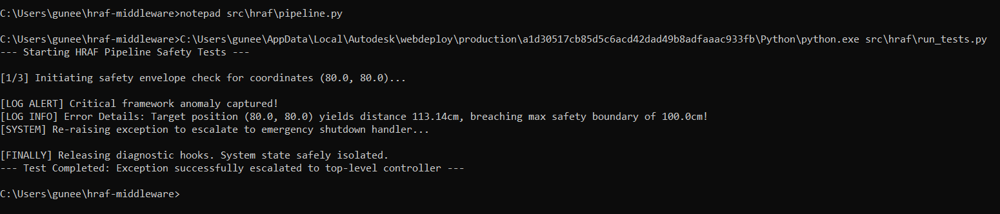

# Week 1

This repository contains the production-ready middleware pipeline and data structures for the Hybrid Robot Action Framework (HRAF), built using the Single Responsibility Principle (SRP) and strict Python type hinting.

## Expected Data Structures & Usage

Below are the standardized, thread-safe data structures implemented in `src/hraf/states.py` for integration with ADCA and HARM in Week 8.

### 1. RobotState (Immutable Telemetry)
```python
from hraf.states import RobotState

# Instantiating a thread-safe snapshot of robot telemetry
state = RobotState(
    position=(1.0, 2.0, 3.0),
    orientation=(0.0, 0.0, 0.0, 1.0),
    joint_angles=[0.0, 45.0, 90.0],
    timestamp=1714560000.0
)

# Attempting to mutate a property will raise an AttributeError:
# state.position = (4.0, 5.0, 6.0)  # BLOCKED (Thread-Safe)
```

### 2. VLMCommand (Vision-Language Model Output)
```python
from hraf.states import VLMCommand

# Capturing instruction sets from the high-level AI model
command = VLMCommand(
    waypoints=[(1.0, 2.0, 3.0), (4.0, 5.0, 6.0)],
    obstacles=["table_leg", "human_hand"],
    confidence=0.92,
    raw_response="Move past the table leg while avoiding the human hand."
)
```

## Expected Pipeline Output Preview

Below is a snippet of the generated data processing output from yesterday's task.

### 3. Generated User Report Output (Text Snapshot)
```text
--- USER REPORT ---
ID: USR001 | Name: Guneet Kaur | Age: 25
ID: USR002 | Name: John Doe | Age: 42
-------------------
Total Users: 2
Average Age: 33.5
```

---

## Day 3 Validation: Middleware Exception Pipeline
Below is the execution stream of the custom exception handling architecture tracking an out-of-bounds physical coordinate constraint breach:




## Day 4 Validation: Core Telemetry & Command Unit Test Suite
Below is the execution stream of the automated pytest verification matrix tracking data structure validation, type enforcement, immutability barriers, and boundary limits:


## Day 5 Validation: Pydantic v2 Schema Gatekeeper
Below is the automated pytest output verifying our Stage 3 validation rules. This test execution stream demonstrates our defensive middleware pipeline successfully intercepting adversarial inputs (including type corruptions, out-of-range confidence thresholds, empty waypoint lists, and missing parameters) at the schema gate level:


## All test passing (pytest green)


============================================================================================

## 🗓️ Week 2: Concurrency, Threads & The GIL

### Day 1: Thread Basics & OS Scheduling
* **What I Studied:** Studied how threads work and learned about the **Global Interpreter Lock (GIL)**.
* **What I Coded:** Wrote a Python script inside `threads_demo.ipynb` that runs 3 threads at the exact same time.
* **What I Observed:** Noticed that the outputs from the threads shuffle and mix together in a random order every time the code runs. This happens because the Operating System's Thread Scheduler controls the exact timing, not our code.


### Day 2: Race Conditions
* **Created a Race Condition:** Set up two threads to increase a shared counter 10,000 times at the same time.
* **Observed Data Errors:** Ran the script 10 times and watched the final total change every time, never reaching the expected 20,000 because threads overwrote each other.
* **Fixed with a Lock:** Added `threading.Lock()` to force the threads to wait in line, making sure the final count hits exactly 20,000 every single run.
* **Added Code Comments:** Wrote clear notes explaining how the computer's read-modify-write steps caused the race condition and why the lock fixed it.


### Day 3: Thread Event & Signaling
* **Studied Event Basics:** Learned how `threading.Event` works using `set()`, `clear()`, `wait()`, and `is_set()` to pause threads without wasting CPU power.
* **Built a Stop Event Pattern:** Created a background thread that runs continuously and checks a flag to shut down safely when ordered.
* **Built a Ready Event Pattern:** Synchronized two threads so that Thread A stops completely and waits until Thread B signals that it is ready to proceed.


### Day 4: Thread-Safe Queues & Latency Management
* **Studied Queue Basics:** Learned how `queue.Queue` works using `put()`, `get()`, `get_nowait()`, `task_done()`, `join()`, and `maxsize` to share data safely between threads.
* **Built a Balanced Pipeline:** Created a system where a producer sends sensor data and a consumer processes it at the exact same speed.
* **Tested Latency Accumulation:** Proved that if a producer sends data faster than a consumer can read it, the queue fills up with old, lagging data.
* **Implemented Bounded Flush Semantics:** Programmed a limited queue that clears out and drops old data packets so the consumer always uses the newest information.

  
### Day 5: Full Producer-Consumer Demo & Latency Log
* **Build:** Created a two-thread system where a slow AI camera sends commands every 0.5s and a fast motor checks them 100 times per second.
* **Use:** Set up a `Queue(maxsize=1)` so the system throws away old, unread commands and instantly replaces them with the newest update.
* **Log:** Recorded creation and reading times to prove that our pipeline sends information almost instantly with zero data lag.

============================================================================================
## 🗓️ Week 3: System Design Thinking & Software Architecture Patterns 

### Day 1: Block Diagrams & Interfaces
* Read Section 4 of the HRAF Proposal document and built the HRAF Data Flow loop
* For each box, wrote down its inputs (including data type and source), outputs (including data type and destination), and error states
* Drew the full data flow on paper as well as digital: Simulator → VLM → HARM → IK → Simulator as a labeled diagram.


## Day 2: System-1 / System-2 Architecture 
* Studied Kahneman’s dual-process theory comparing System-1 (fast, reactive) and System-2 (slow, deliberate).
* Read the VLA-Perf paper (arXiv:2602.18397) to apply human dual-system traits to robot control modules
* Wrote a note identifying the fast IK loop as System-1 and the slow VLM brain as System-2 and Explained why coupling them slows the robot down and why they must be decoupled to fix the latency problem


## Day 3: Finite State Machines', 2100 
* Studied FSM concepts including **states, transitions, guards (conditions), and actions (side effects).
* Modeled the **HARM module** as a Finite State Machine with states: **IDLE, VALIDATING, FEASIBILITY_CHECK, EXECUTING, RECOVERY, and FAULT**.
* Drew a complete FSM diagram and documented all state transitions, specifying the triggering event and action performed for each transition


## Day 4: Failure Mode Analysis
* Identified three failure modes for each core module, separating them into the VLM, HARM, IK Solver, and State Bridge.
* Documented the specific trigger event, the downstream system effect, and the recovery method for every failure mode.
* Classified all system errors to determine which issues can be recovered automatically versus which ones are completely unrecoverable.
* Specified exactly which critical failures trip an emergency system stop and require a human operator to step in and fix the issue.


## Day 5: Interface Design for ADCA & HARM
* Designed Python interface stubs as abstract base classes to define structural code contracts before implementation.
* Created the ADCA blueprint detailing the initialization variables, loop frequencies, runtime controls, and state bridge retrieval.
* Created the HARM blueprint specifying text validation inputs returning structured results and error recovery paths returning fallback commands.


## 🗓️ Week 4: Python asyncio: Event Loop, Coroutines & Tasks 

## Day 1: Event Loop & Coroutines 
* Studied how the async event loop runs coroutines and manages tasks on a single thread.
* Built a Python coroutine using asyncio.sleep(0.3) to simulate real VLM API delay.
* Tested and compared running 5 VLM calls back-to-back versus all at once using asyncio.gather().
* Measured and documented a 1.20-second speedup, proving concurrency keeps the robot control loop from freezing.

## Day 2: Tasks & Cancellation
* Studied how asyncio.create_task() launches background tasks so the main code keeps running immediately without waiting.
* Learned how task.cancel() injects an asyncio.CancelledError to stop a running task right at its next pause point.
* Built a continuous 100Hz robot tracking loop that catches cancellation to safely drop motor torque and lock hardware brakes.
* Coded a timeout guard using asyncio.wait_for() to safely catch hanging network calls and instantly trigger fallback backup sensors.

## Day 3: asyncio.Queue & Async Producer-Consumer
* Studied asyncio.Queue vs queue.Queue, confirming that async queues use non-blocking coroutine suspension instead of thread-locking primitives.
* Rebuilt the Producer-Consumer demo pipeline into a single-threaded asynchronous framework using concurrent producer and consumer coroutines.
* Verified that the high-frequency IK consumer operates at its own independent cadence, pulling data from the state bridge without being stalled by VLM processing delays.


## Day 4: asyncio vs. threading Decision Matrix
* Studied Concurrency Choices: Learned to use single-threaded asyncio for fast network/VLM calls and threading as the fallback for heavy, blocking hardware tasks.
* Identified Loop Freezes: Discovered that calling a standard synchronous function directly inside async code completely freezes the single system thread, cutting off critical safety signals.
* Explored loop.run_in_executor(), which offloads slow, blocking legacy code to a background thread pool so the main loop can keep breathing.
* Built the ADCA Bridge: Programmed a script that handles an async VLM camera check while running a heavy 1.5-second blocking MoveIt 2 calculation in the background, proving the main control loop stays 100% active and responsive.


## Day 5: Async Latency Measurement 
* Created a benchmark with a 100Hz IK loop and a simulated VLM inference task running concurrently using asyncio.
* Logged IK loop timestamps with time.perf_counter() and used deadline scheduling to maintain a 10ms target period.
* Confirmed that the IK loop maintained ~100Hz while VLM inference was running in parallel.
* Generated timing plots and statistics, showing only minor jitter and no significant control-loop delays.


## 🗓️ Week 5: Latency Engineering: Measurement, Profiling & Optimisation 

## Day 1: Latency Measurement Fundamentals
* Studied `time.perf_counter()`, `time.process_time()`, and `time.monotonic()` for measuring different types of time delays.
* Learned why average latency can hide slow cases and how P50, P95, and P99 show latency spikes.
* Studied warm-up effects in API calls and why the first few requests are removed before measuring actual performance.
* Measured 50 `asyncio.sleep(0)` calls, plotted the latency, and analyzed async event loop scheduling overhead.


## Day 2: LatencyProfiler Class
* Architected Standalone Profiler: Built LatencyProfiler inside src/hraf/profiler.py using only numpy and matplotlib for framework-wide utility.
* Implemented Percentile Math: Added clean tracking for p50, p95, p99, mean, and standard deviation using numpy.percentile().
* Validated Tail Latencies: Verified calculations using 100 log-normal simulation points to accurately map worst-case latency spikes.
* Added CSV Data Export: Integrated export_csv() to save raw timing entries to disk for reproducible research benchmarks.


## Day 3: VLM API Latency Study
* Executed Cloud Infrastructure Sweeps: Ran 33 live API requests across Tier L2 (Gemini 1.5 Flash) and Tier L3 (Groq Llama3) to evaluate cloud-to-edge middleware performance.
* Isolated Network Initialization Noise: Discarded the first 3 samples of each sweep as warm-up cycles to ensure calibration and protect downstream statistical data from initial connection spikes.
* Captured Temporal Traffic Variances: Conducted multi-window testing across both afternoon (off-peak) and evening (peak load) periods to analyze real-world API server congestion.
* Mapped ADCA Safety Boundaries: Extracted P50, P95, and P99 percentiles along with dual-window distribution charts to establish worst-case latency boundaries for control loop decoupling.


## Day 4: Code Profiling
* **Inspected Image Encoding Pipeline:** Used cProfile and line_profiler to review the execution time of the image-to-text conversion script line by line.
* **Isolated Primary Function Bottleneck:** Discovered that saving images to memory buffers via standard library tools consumed **78.5%** of total system processing cycles.
* **Tested Multiple Optimization Vectors:** Evaluated compression settings, image downsampling, and library variations side by side to reduce processing overhead.
* **Slashed Processing Latency:** Applied JPEG compression adjustments to drop overall execution times by **50.5%**, keeping the loop fast enough for real-time control.
